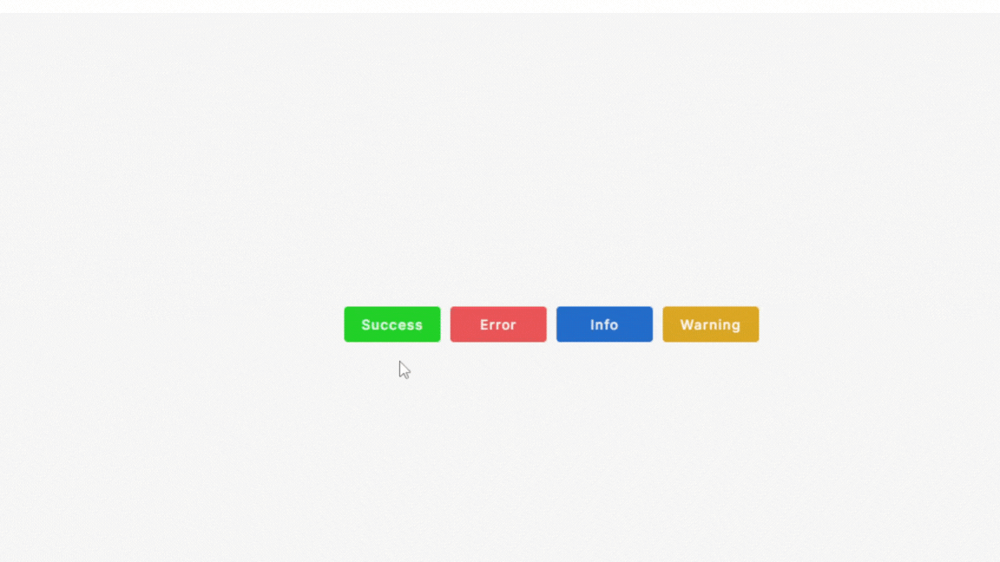

# React Custom Toast Notification with Redux Toolkit and Custom Hook

A simple and customizable React Toast Notification component with Redux Toolkit to manage the state of notifications in your React applications.

## Features

- **Customizable Notifications**: Display success, error, info, and custom toast notifications.
- **Redux Toolkit Integration**: Easy management of toast states using Redux.
- **Custom React Hook**: trigger notification by custom react hook.
- **Customizable Options**: Options for setting the type, auto-dismiss duration for each notification.
- **Animation Support**: Toast notifications come with smooth animations for appearing and disappearing.
- **Easy Integration**: Easy to integrate into any React project.

## Preview



## Installation

You can install the `react-custom-toast-notification` component along with Redux Toolkit via npm.

1. Clone the repository:

   ```bash
   git clone https://github.com/rupeshpatil27/react-custom-toast-notification.git
   ```

2. Navigate to the project folder:

   ```bash
   cd react-custom-toast-notification
   ```

3. Install the dependencies using npm:

   ```bash
   npm install
   ```

### Example of usage in a React app:

1. Create a Redux slice for managing toast notifications

First, we need to set up Redux with a slice to handle notifications globally.
Create a file called `src\features\toast\toastSlice.js`:

    ```js
    import { createSlice } from "@reduxjs/toolkit";

    const initialState = {
    toastMsg: null,
    };

    const toastSlice = createSlice({
    name: "toast",
    initialState,
    reducers: {
        showToast: (state, action) => {
        state.toastMsg = action.payload;
        },
        removeToast: (state) => {
        state.toastMsg = null;
        },
    },
    });

    export const { showToast, removeToast } = toastSlice.actions;

    export default toastSlice.reducer;
    ```

2. Set up the Redux store

Create a `src\store\store.js` file to configure the Redux store:

    ```js
    import { configureStore } from "@reduxjs/toolkit";
    import toastReducer from "../features/toast/toastSlice";

    export const store = configureStore({
    reducer: {
        toast:toastReducer,
    },
    });
    ```

3. Provide the Redux store to your application

Wrap your application with the Redux `Provider` at the root level:

    ```jsx
    // main.jsx

    import { StrictMode } from 'react'
    import { createRoot } from 'react-dom/client'
    import './index.css'
    import App from './App.jsx'
    import { Provider } from 'react-redux'

    import { store } from "./store/store.js";

    createRoot(document.getElementById('root')).render(
    <StrictMode>
        <Provider store={store}>
            <App />
        </Provider>
    </StrictMode>,
    )
    ```

4. Creating the Toast Notification Component

Define the markup for toast notification by creating a new file in the `src\component\ToastNotification` folder called `ToastNotification.jsx`:

    ```jsx
    import React from "react";

    import "./ToastNotification.css"

    import { MdInfo, MdWarning, MdCheckCircle, MdError } from "react-icons/md";

    function ToastNotification({ type = "info", message }) {
        const icons = {
            success: <MdCheckCircle className={`icon ${type}`} />,
            info: <MdInfo className={`icon ${type}`} />,
            warning: <MdWarning className={`icon ${type}`} />,
            error: <MdError className={`icon ${type}`} />,
        };
        return (
            <div className="toast-error-container">
                <div className="icon-container">{icons[type]}</div>
                <div className="error-message">
                    <span>{message ? message : ""}</span>
                </div>
            </div>
        );
    }

    export default ToastNotification;
    ```

The `ToastNotification` takes two props - `type` and `message`. The `type` prop is used to determine the type of notification and the corresponding icon and icon class name.The `message` prop is used to display the text message of the notification.

5. Styling the Toasts

customize the appearance of the toasts using CSS or styled-components. Below is an example of styling for the toast container:

    ```css
     /* ToastNotification.css */

    .toast-error-container {
        background-color: #000;
        position: fixed;
        bottom: 20rem;
        display: flex;
        align-items: center;
        justify-content: center;
        opacity: 0;
        visibility: hidden;
        animation: openSliderMsg 0.4s ease-in-out forwards;
    }

    @keyframes openSliderMsg {
        0% {
            opacity: 0;
            visibility: visible;
            transform: translateY(20rem);
        }
        100% {
            opacity: 1;
            visibility: visible;
            transform: translateY(0);
        }
    }

    @keyframes closeSliderMsg {
        100% {
            opacity: 1;
            visibility: visible;
            transform: translateY(20rem);
        }
        0% {
            opacity: 0;
            visibility: hidden;
            transform: translateY(0);
        }
    }

    .toast-error-container .icon-container {
        padding: 1.3rem;
        display: block;
    }

    .toast-error-container .icon-container .icon {
        font-size: 2.5rem;
    }

    .success {
        color:#1fd11f;
    }
    .info {
        color:#1f6cd1;
    }
    .warning {
        color: rgb(218, 166, 25);
    }
    .error {
        color: rgb(233, 83, 83);
    }

    .toast-error-container .error-message {
        padding: 1.3rem 1rem 1.3rem 0;
        margin-left: 0.5rem;
    }

    .toast-error-container .error-message span {
        font-size: 1.3rem;
        text-align: left;
        font-weight: 500;
        text-transform: capitalize;
        color: #fff;
    }
    ```

6. Create the custom `useToastNotification` hook

create a new file `useToastNotification.jsx` in the `src\hooks` folder and add the following code:

    ```jsx
    import React, { useCallback } from "react";
    import ToastNotification from "../components/ToastNotification/ToastNotification";
    import { removeToast, showToast } from "../features/toast/toastSlice";
    import { useDispatch, useSelector } from "react-redux";

    const useToastNotification = () => {
    const dispatch = useDispatch()
    const { toastMsg } = useSelector((state) => state.toast);

    let timer;

    const toast = useCallback((notificationProps) => {
        clearTimeout(timer);
        dispatch(showToast(notificationProps)) //dispatch action for show toast notification

        timer = setTimeout(() => {
        dispatch(removeToast()) //dispatch action for remove toast notification after timeout
        }, notificationProps.duration);
    }, []);


    const notificationComponent = toastMsg ? (
        <ToastNotification {...toastMsg} />
    ) : null;

    return { notificationComponent, toast };
    };

    export default useToastNotification;
    ```

7. Use the `useToastNotification` hook

Here's a complete example of using the `useToastNotification` hook:

    ```jsx
    import './App.css'

    import useToastNotification from "./hooks/useToastNotification";

    function App() {
        // Destructure the notificationComponent and toast from the hook
        const { notificationComponent, toast } = useToastNotification();
    return (
        <div className="main-container">

            <div className="btn-container">

                <button className="toast-btn success-btn" onClick={() => toast({
                type: "success",
                message: "Toast notification for success Message",
                duration: 1000,
                })}>
                Success
                </button>

                <button className="toast-btn error-btn" onClick={() => toast({
                type: "error",
                message: "Toast notification for error Message",
                duration: 1000,
                })}>
                Error
                </button>

                <button className="toast-btn info-btn" onClick={() => toast({
                type: "info",
                message: "Toast notification for info Message",
                duration: 1000,
                })}>
                Info
                </button>

                <button className="toast-btn warning-btn" onClick={() => toast({
                type: "warning",
                message: "Toast notification for warning Message",
                duration: 1000,
                })}>
                Warning
                </button>

            </div>
            {/* Notification component should be rendered somewhere */}
            {notificationComponent}
        </div>
        )
    }
    export default App
    ```

The `useToastNotification` hook returns two key things:

- **`notificationComponent`**: The component that renders the notifications.
- **`toast`**: A method for different types of notifications (`success`, `error`, `info`, `warning`).

  Example:

  ```jsx
  // Trigger a toast
  toast({
    type: "[`success`, `error`, `info`, `warning`]",
    message: "[Toast Message]",
    duration: "[milliseconds]",
  });

  
  //Notification component should be rendered somewhere 
  {notificationComponent}
  ```

### Options:

pass the following options to customize the notifications:

- **`type`** (String, required): The type of toast notification (`success`, `error`, `info`, `warning`).
- **`message`** (String, required):The message to be displayed inside the toast notification.
- **`duration`** (Number, required):The duration (in milliseconds) after which the toast will automatically dismiss itself.. eg set `1000` for 1 sec.
